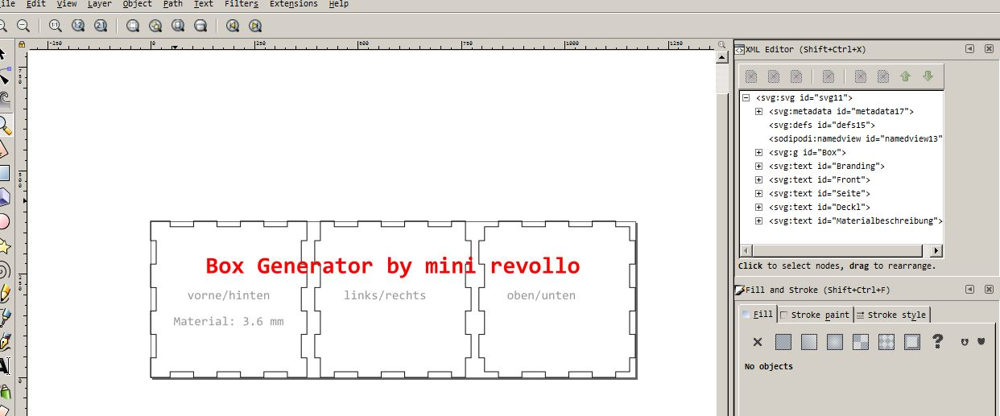

# Box-Generator

Ein **Python** Programm um eine Box mit Fingerzinken für einen **Lasercutter** zu generieren.

Im Programm werden die **Dimensionen** der Box, die **Materialstärke** und die **Zinkenbreite** eingegeben. Anschließend wird eine SVG erstellt und im zuständigen Standardprogramm des Betriebssystems geöffnet.

Es werden nur drei Seiten der Box angezeigt. Für die komplette Box müssen diese Seiten **zweimal** geschnitten werden. 

Auf den Flächen können nun auch noch Gravierungen oder Löcher eingearbeitet werden.

Im **XML Editor von Inkscape** kann man schön den Aufbau der SVG erkennen.

